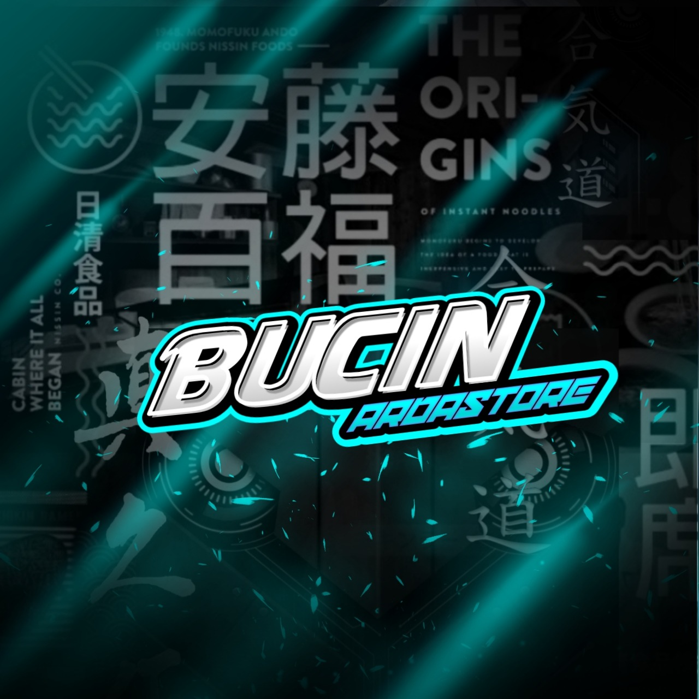

<h1 align='center'> Hi There I'm ARDA-SAHA </h1>

___

___

  
<b><i>STATUS GITHUB</i></b>

  
  
  

<b><i>LANGUAGES SKILL</i></b>

 
<!--p></p-->

&nbsp;

<b><i>HELP ME DONATE</i></b>

</ul>

### <b>SOCIAL MEDIA</b>
- 
-  
- 
- 
- 

